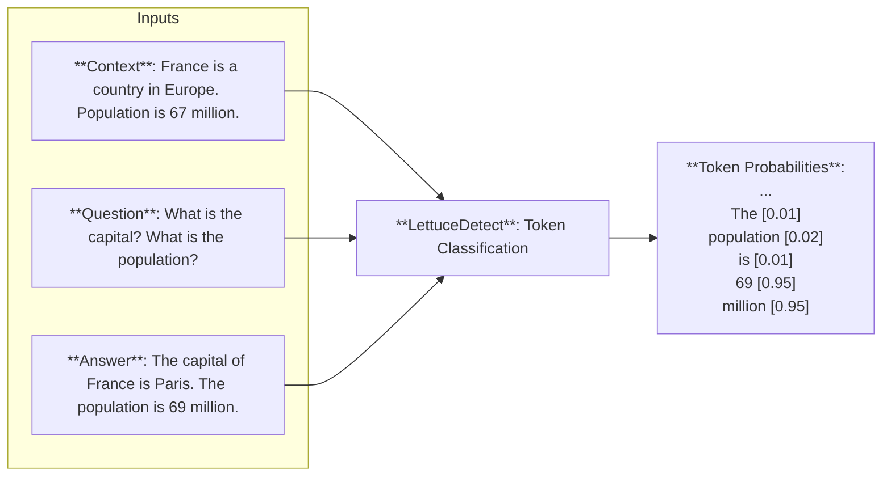

# LettuceDetect 🥬🔍


<p align="center">
  
  <br><em>Because even AI needs a reality check! 🥬</em>
</p>

LettuceDetect is an open span-level grounding verifier for AI outputs. Given source evidence, it localizes unsupported, contradictory, or fabricated parts of RAG answers, coding-agent responses, and tool-grounded outputs. The project includes fast local encoder models as well as generative detectors that can type each detected span.

Our models are inspired from the [Luna](https://aclanthology.org/2025.coling-industry.34/) paper which is an encoder-based model and uses a similar token-level approach.

[](https://pypi.org/project/lettucedetect/)
[](https://opensource.org/licenses/MIT)
[](https://huggingface.co/KRLabsOrg)
[](https://colab.research.google.com/drive/1Ubca5aMaBGdHtJ1rpqj3Ke9SLEr-PaDn?usp=sharing)
[](https://arxiv.org/abs/2502.17125)
[](https://discord.gg/RspnGxJNMa)

See the [public roadmap](PUBLIC_ROADMAP.md) for what is landing in the next release and the research directions open for collaboration.

## Highlights

- Returns exact character spans instead of only an answer-level clean/flagged verdict.
- Supports RAG prose, multilingual QA, code-agent answers, and developer-tool output.
- Offers purpose-built encoder models for local inference and generative models for typed spans.
- Publishes scoped benchmark results and model limitations in the [benchmark documentation](docs/benchmarks.md) and [model cards](docs/code-hallucination/).

## 🥬👨‍💻 New (June 2026): code, tool output & agentic workflows

<p align="center"></p>

<p align="center"><em>LettuceDetect goes agentic — span-level hallucination detection across RAG, code, and tool output.</em></p>

LettuceDetect now detects hallucinations in **coding-agent** answers — grounded in repository source and developer-tool output, not only prose. The new detectors localize (and type) unsupported spans of an answer: invented APIs/identifiers, wrong values, and behavior the request never asked for.

- **Models:** `lettucedect-v2-qwen-2b` (generative, emits typed spans in one pass) and `lettucedect-v2-mmbert-base` (fast encoder) — a single model across code, tool output, and prose (including 14-language [PsiloQA](https://huggingface.co/datasets/s-nlp/PsiloQA) and [RAGTruth](https://aclanthology.org/2024.acl-long.585/)).
- **Benchmark:** a span-annotated code + tool-output + structured-document hallucination dataset — [KRLabsOrg/lettucedetect-code-hallucination](https://huggingface.co/datasets/KRLabsOrg/lettucedetect-code-hallucination).
- On code-agent answers, the fine-tuned 2B detector substantially outperforms the off-the-shelf detectors and large LLM judges we evaluated, which over-flag generated code:

<p align="center"></p>

## 🚀 Latest Updates

- **July 5, 2026** - Released **0.2.2**, fixing `method="llm"` confidence validation and adding a detector-hierarchy regression test.
- **July 2, 2026** - Released **0.2.1** with `min_confidence`, contributor infrastructure, and packaging fixes.
- **June 22, 2026** - Released **0.2.0** with code/tool/agentic models, typed spans, the encoder taxonomy cascade, and automatic context chunking. See the [changelog](CHANGELOG.md) for the complete release notes.
- **August 31, 2025** - Released version **0.1.8**: Added TinyLettuce Ettin models for 17M, 32M, and 68M variants, Hallucination generation pipeline and added RAGFactChecker for triplet-based hallucination detection.
  - See [TinyLettuce Blog Post](https://huggingface.co/blog/adaamko/tinylettuce) for more details.
  - Our collection on Hugging Face: [TinyLettuce](https://huggingface.co/collections/KRLabsOrg/tinylettuce-68b42a66b8b6aaa4bf287bf4)
  - See the documentation: [TinyLettuce Documentation](docs/TINYLETTUCE.md) for more details.
- May 18, 2025 - Released version **0.1.7**: Multilingual support (thanks to EuroBERT) for 7 languages: English, German, French, Spanish, Italian, Polish, and Chinese!
- Up to **17 F1 points improvement** over baseline LLM judges like GPT-4.1-mini across different languages
- **EuroBERT models**: We've trained base/210M (faster) and large/610M (more accurate) variants
- You can now also use **LLM baselines** for hallucination detection (see below)

## Get going  

### Features

- ✨ **Token-level precision**: detect exact hallucinated spans
- 🚀 **Optimized for inference**: smaller model size and faster inference
- 🧠 **Long context window** support (4K for ModernBERT, 8K for EuroBERT)
- 🌍 **Multilingual support**: 7 languages covered
- ⚖️ **MIT-licensed** models & code
- 🤖 **HF Integration**: one-line model loading
- 📦 **Easy to use python API**: can be downloaded from pip and few lines of code to integrate into your RAG system

### Installation

Install from the repository:
```bash
pip install -e .
```

From pip:
```bash
pip install lettucedetect -U
```

### Quick Start

Check out our models published to Huggingface: 

**English Models**:
- Base: [KRLabsOrg/lettucedect-base-modernbert-en-v1](https://huggingface.co/KRLabsOrg/lettucedect-base-modernbert-en-v1)
- Large: [KRLabsOrg/lettucedect-large-modernbert-en-v1](https://huggingface.co/KRLabsOrg/lettucedect-large-modernbert-en-v1)

**Multilingual Models**:
We've trained 210m and 610m variants of EuroBERT, see our HuggingFace collection: [HF models](https://huggingface.co/collections/KRLabsOrg/multilingual-hallucination-detection-682a2549c18ecd32689231ce)

> **Note:** the EuroBERT models load remote code that is not yet compatible with transformers 5.x. When using them, install `pip install "transformers>=4.48.3,<5"` (see [#33](https://github.com/KRLabsOrg/LettuceDetect/issues/33)). ModernBERT models are unaffected.

**Code / Tool / Agentic Models (v2 — new)**:
- Generative (emits typed spans in one pass): [KRLabsOrg/lettucedect-v2-qwen-2b](https://huggingface.co/KRLabsOrg/lettucedect-v2-qwen-2b)
- Encoder (fast, binary spans): [KRLabsOrg/lettucedect-v2-mmbert-base](https://huggingface.co/KRLabsOrg/lettucedect-v2-mmbert-base)
- One model across code, tool output, and prose — trained on the [code+tool+docs hallucination benchmark](https://huggingface.co/datasets/KRLabsOrg/lettucedetect-code-hallucination).


*See the full list of models and smaller variants in our [HuggingFace page](https://huggingface.co/KRLabsOrg).*

You can get started right away with just a few lines of code.

```python
from lettucedetect.models.inference import HallucinationDetector

# For English:
detector = HallucinationDetector(
    method="transformer", 
    model_path="KRLabsOrg/lettucedect-base-modernbert-en-v1",
)

# For other languages (e.g., German):
# detector = HallucinationDetector(
#     method="transformer", 
#     model_path="KRLabsOrg/lettucedect-210m-eurobert-de-v1",
#     lang="de",
#     trust_remote_code=True
# )

contexts = ["France is a country in Europe. The capital of France is Paris. The population of France is 67 million.",]
question = "What is the capital of France? What is the population of France?"
answer = "The capital of France is Paris. The population of France is 69 million."

# Get span-level predictions indicating which parts of the answer are considered hallucinated.
predictions = detector.predict(context=contexts, question=question, answer=answer, output_format="spans")
print("Predictions:", predictions)

# Predictions: [{'start': 31, 'end': 71, 'confidence': 0.9944414496421814, 'text': ' The population of France is 69 million.'}]
```

Check out our [HF collection](https://huggingface.co/collections/KRLabsOrg/multilingual-hallucination-detection-682a2549c18ecd32689231ce) for more examples.

We also implemented LLM-based baselines, for that add your OpenAI API key:

```bash
export OPENAI_API_KEY=your_api_key
```

Then in code:

```python
from lettucedetect.models.inference import HallucinationDetector

# For German:
detector = HallucinationDetector(method="llm", lang="de")

# Then predict the same way
predictions = detector.predict(context=contexts, question=question, answer=answer, output_format="spans")
```

### Typed spans (v2)

The v2 models go beyond "hallucinated / not" and assign each span a **category** and **subcategory** from the hallucination taxonomy. With the encoder cascade, add a typing head on top of the fast binary detector:

```python
from lettucedetect.models.inference import HallucinationDetector

detector = HallucinationDetector(
    method="transformer",
    model_path="KRLabsOrg/lettucedect-v2-mmbert-base",        # finds spans
    taxonomy_head="KRLabsOrg/lettucedect-v2-taxonomy-head",   # types them
)
predictions = detector.predict(context=contexts, question=question, answer=answer, output_format="spans")
# [{'start': 31, 'end': 71, 'text': ' The population of France is 69 million.',
#   'category': 'contradiction', 'subcategory': 'numerical'}]
```

The generative model `lettucedect-v2-qwen-2b` produces the same typed spans in a single pass (no separate head) and can also return a short reason per span.

## Performance

We've evaluated our models against both encoder-based and LLM-based approaches. Results are specific to the stated model, dataset, split, and metric:

- On the unified 10,698-example v2 test set, Qwen-2B reaches 0.689 span-F1 and mmBERT-base reaches 0.642.
- On the RAGTruth slice of that same evaluation, Qwen-2B reaches 0.574 span-F1 and mmBERT-base reaches 0.528. These should not be confused with the unified scores.
- On code-agent answers, Qwen-2B reaches 0.602 span-F1; the released paper and model cards document the benchmark construction and limitations.
- The original English and multilingual model families have their own evaluation protocols; use their documentation rather than comparing numbers across protocols as one leaderboard.

For detailed performance metrics and evaluations of our models:
- [English model documentation](docs/README.md)
- [Multilingual model documentation](docs/EUROBERT.md)
- [Paper](https://arxiv.org/abs/2502.17125)
- [Model cards](https://huggingface.co/KRLabsOrg)

## How does it work?

The model is a token-level model that predicts whether a token is hallucinated or not. The model is trained to predict the tokens that are hallucinated in the answer given the context and the question.



### Training a Model

You need to download the RAGTruth dataset first from [here](https://github.com/ParticleMedia/RAGTruth/tree/main/dataset), then put it under the `data/ragtruth` directory. Then run

```bash
python lettucedetect/preprocess/preprocess_ragtruth.py --input_dir data/ragtruth --output_dir data/ragtruth
```

This will create a `data/ragtruth/ragtruth_data.json` file which contains the processed data.

Then you can train the model with the following command.

```bash
python scripts/train.py \
    --ragtruth-path data/ragtruth/ragtruth_data.json \
    --model-name answerdotai/ModernBERT-base \
    --output-dir output/hallucination_detector \
    --batch-size 4 \
    --epochs 6 \
    --learning-rate 1e-5 
```

We trained our models for 6 epochs with a batch size of 8 on a single A100 GPU.

### Evaluation

You can evaluate the models on each level (example, token and span) and each data-type.

```bash
python scripts/evaluate.py \
    --model_path outputs/hallucination_detector \
    --data_path data/ragtruth/ragtruth_data.json \
    --evaluation_type example_level
```

### Model Output Format

The model can output predictions in two formats:

#### Span Format
```python
[{
    'text': str,        # The hallucinated text
    'start': int,       # Start position in answer
    'end': int,         # End position in answer
    'confidence': float # Model's confidence (0-1)
}]
```

Use `min_confidence` with span output to drop predictions below a threshold:

```python
detector.predict(
    context=contexts,
    question=question,
    answer=answer,
    output_format="spans",
    min_confidence=0.8,
)
```

For transformer detectors, emitted hallucination spans already have
confidence values of at least `0.5`, so thresholds below `0.5` are no-ops;
higher thresholds raise that floor.

### Token Format
```python
[{
    'token': str,       # The token
    'pred': int,        # 0: supported, 1: hallucinated
    'prob': float       # Model's confidence (0-1)
}]
```

## Streamlit Demo

Check out the Streamlit demo to see the model in action.

Install streamlit:

```bash
pip install streamlit
```

Run the demo:

```bash
streamlit run demo/streamlit_demo.py
```

## Use the Web API

LettuceDetect comes with it's own web API and python client library. To use it, make sure to install the package with the optional API dependencies:

```bash
pip install -e .[api]
```

or

```bash
pip install lettucedetect[api]
```

Start the API server with the `scripts/start_api.py` script:

```bash
python scripts/start_api.py dev  # use "prod" for production environments
```

Usage:

```bash
usage: start_api.py [-h] [--model MODEL] [--method {transformer}] {prod,dev}

Start lettucedetect Web API.

positional arguments:
  {prod,dev}            Choose "dev" for development or "prod" for production
                        environments. The serve script uses "fastapi dev" for "dev" or
                        "fastapi run" for "prod" to start the web server. Additionally
                        when choosing the "dev" mode, python modules can be directly
                        imported from the repositroy without installing the package.

options:
  -h, --help            show this help message and exit
  --model MODEL         Path or huggingface URL to the model. The default value is
                        "KRLabsOrg/lettucedect-base-modernbert-en-v1".
  --method {transformer}
                        Hallucination detection method. The default value is
                        "transformer".
```

Example using the python client library:

```python
from lettucedetect_api.client import LettuceClient

contexts = [
    "France is a country in Europe. "
    "The capital of France is Paris. "
    "The population of France is 67 million.",
]
question = "What is the capital of France? What is the population of France?"
answer = "The capital of France is Paris. The population of France is 69 million."

client = LettuceClient("http://127.0.0.1:8000")
response = client.detect_spans(contexts, question, answer)
print(response.predictions)

# [SpanDetectionItem(start=31, end=71, text=' The population of France is 69 million.', hallucination_score=0.989198625087738)]
```

See `demo/detection_api.ipynb` for more examples.
For async support use the `LettuceClientAsync` class instead.

## Community

Use [GitHub Discussions](https://github.com/KRLabsOrg/LettuceDetect/discussions) for use cases, research questions, and proposals that are not yet scoped work. Join us on [Discord](https://discord.gg/RspnGxJNMa) for informal conversation. New contributors can check the [`good first issue`](https://github.com/KRLabsOrg/LettuceDetect/issues?q=is%3Aopen+label%3A%22good+first+issue%22) and [`help wanted`](https://github.com/KRLabsOrg/LettuceDetect/issues?q=is%3Aopen+label%3A%22help+wanted%22) issues; items labeled [`status: claimed`](https://github.com/KRLabsOrg/LettuceDetect/issues?q=is%3Aopen+label%3A%22status%3A+claimed%22) already have active work.

## License

MIT License - see LICENSE file for details.

## Citation

Please cite the following paper if you use LettuceDetect in your work:

```bibtex
@misc{Kovacs:2025,
      title={LettuceDetect: A Hallucination Detection Framework for RAG Applications}, 
      author={Ádám Kovács and Gábor Recski},
      year={2025},
      eprint={2502.17125},
      archivePrefix={arXiv},
      primaryClass={cs.CL},
      url={https://arxiv.org/abs/2502.17125}, 
}
```
