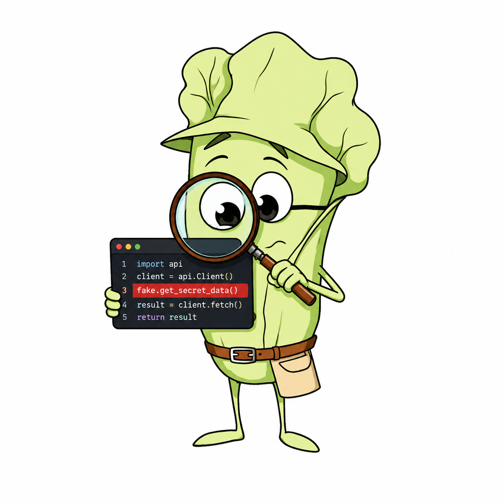

# lettucedect-v2-taxonomy-head: Span Typing Head (encoder cascade)

## Overview

`lettucedect-v2-taxonomy-head` **types** a hallucinated span — it does not find spans. It is a
label-conditioned **mmBERT-base bi-encoder** that, given a span a binary detector already
located, assigns a hallucination **category** and **subcategory** by embedding the span and
taking the nearest taxonomy-label *description* (cosine). Paired with the binary encoder
`lettucedect-v2-mmbert-base`, it forms a **fully-encoder typed detector** — detection + typing
at encoder cost, no generative model.

- **Taxonomy:** 3 categories (contradiction, fabricated_reference, unsupported_addition) × 13 subcategories.
- **Stage-B only:** run a binary detector (e.g. `lettucedect-v2-mmbert-base`) first, then this head types each span.
- For detection **and** typing in a single pass, see the generative `lettucedect-v2-qwen-2b`.

## Usage (cascade, via lettucedetect)

```python
from lettucedetect.models.inference import HallucinationDetector

det = HallucinationDetector(
    method="transformer",
    model_path="KRLabsOrg/lettucedect-v2-mmbert-base",      # binary detector (finds spans)
    taxonomy_head="KRLabsOrg/lettucedect-v2-taxonomy-head",  # this head (types them)
)
spans = det.predict(context=[context], question=question, answer=answer, output_format="spans")
# [{"start": ..., "end": ..., "text": "...", "category": "contradiction", "subcategory": "numerical"}]
```

## Training

A **label-conditioned bi-encoder**. A shared mmBERT-base encoder embeds (i) a span — the
mean-pooled answer tokens of the input `answer [CTX] context` — and (ii) each taxonomy label
as the mean-pooled embedding of its `"name: description"` text. Training minimizes cross-entropy
between the span embedding and the label embeddings (temperature-scaled cosine similarity),
jointly over the category and subcategory label sets, so a span is typed by its nearest label
*description*. Because labels enter only as text, the same head scores any label in the taxonomy.

Trained on the per-span category/subcategory annotations of the unified **code + prose**
hallucination benchmark — SWE-bench coding-agent traces, developer tool output, ACL / README /
Wikipedia, plus RAGTruth and 14-language PsiloQA.

## Performance

- **Typing accuracy (given a gold span):** category **0.82** / subcategory **0.64** (validation).
- **End-to-end cascade** (binary detector → this head), char-overlap typed-F1 on the unified test
  set: **0.461** (subcategory-gated 0.315). The generative `lettucedect-v2-qwen-2b` types in a
  single pass and is higher (typed-F1 0.585 / 0.468); this cascade is the option when you want
  typed spans from a small, fast **encoder-only** stack.

## Citing

```bibtex
@article{Kovacs2025LettuceDetect,
  title={LettuceDetect: A Hallucination Detection Framework for RAG Applications},
  author={Kovács, Ádám and Recski, Gábor},
  journal={arXiv preprint arXiv:2502.17125},
  year={2025}
}
```
